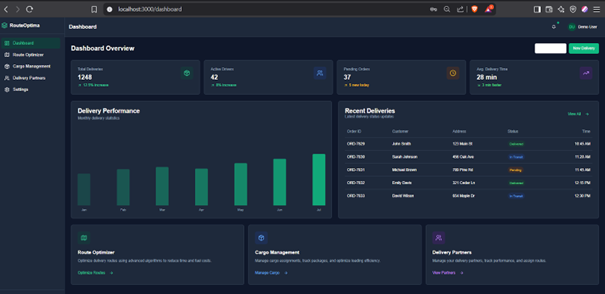

Absolutely! Here's your **final, polished version of the `README.md` file**, fully formatted and ready to copy-paste into your GitHub project:

---

```markdown
# 🚚 Real-Time Delivery Route Optimization System

A comprehensive system for optimizing delivery routes, managing cargo, and tracking deliveries in real-time — with a special focus on the Coimbatore region.

🌐 **Live Demo**: [https://dro-full-smart-app-production.up.railway.app](https://dro-full-smart-app-production.up.railway.app)  
📧 **Email**: [krishnapriyasri04@gmail.com](mailto:krishnapriyasri04@gmail.com)  
📞 **Phone**: +91 90475 47774

---

## 🧠 Features

- ✅ **Route Optimization**: Multiple algorithms for efficient delivery planning  
- 📦 **Cargo Management**: Knapsack algorithm for optimal cargo loading  
- 📡 **Real-Time Tracking**: Monitor delivery status and performance  
- 🗺️ **Coimbatore Mapping**: Region-specific enhancements  
- 📊 **Analytics Dashboard**: Performance reports and insights  

---

## ⚙️ Getting Started

### 📋 Prerequisites

- Node.js 18+  
- npm  
- MySQL 8.0+  
- Docker (optional)

### 🌱 Environment Variables

Create a `.env` file in the root directory with:

```

DB\_HOST=localhost
DB\_PORT=your\_port
DB\_USER=your\_mysql\_username
DB\_PASSWORD=your\_mysql\_password
DB\_NAME=route\_optimizer
NEXT\_PUBLIC\_API\_URL=[http://localhost/api](http://localhost/api)

````

---

### 🛠 Installation

1. **Clone the repository**

```bash
git clone https://github.com/krishnapriyasri2004/DRO-Full-Smart-app.git
cd delivery-route-optimizer
````

2. **Install dependencies**

```bash
npm install
```

3. **Set up the MySQL database**

```bash
mysql -u your_mysql_username -p < db/schema.sql
```

4. **Run the app**

```bash
npm run dev
```

Visit [http://localhost:3000](http://localhost:3000)

---

### 🐳 Docker Setup (Optional)

1. **Build Docker image**

```bash
docker build -t delivery-route-optimizer .
```

2. **Run Docker container**

```bash
docker run -p 3000:3000 --env-file .env delivery-route-optimizer
```

---

## 🚀 Usage Guide

### 📍 Route Management

* Go to the **Routes** section
* Click "Create New Route"
* Enter route and delivery points
* Choose algorithm
* Generate and assign to vehicle

### 📦 Cargo Management

* Go to **Cargo** section
* Add item details (weight, priority)
* Click "Optimize Cargo" (Knapsack algorithm)
* Review and assign

### 📌 Coimbatore-Specific Features

* Select **Coimbatore** in region dropdown
* Access preloaded areas and landmarks
* Use **Tamil support** and traffic integration

---

## 🧮 Algorithms Used

### 🎒 Knapsack Algorithm

* Maximizes priority cargo within space
* Ideal for load balancing and space efficiency

### ⚡ Greedy Algorithm

* Fast and real-time
* Picks the next nearest unvisited point

### 📊 Dynamic Programming

* Computes globally optimal routes
* Best when fewer but high-value deliveries exist

---

## 🗃️ Database Schema Overview

| Table Name             | Description                       |
| ---------------------- | --------------------------------- |
| `locations`            | Delivery and depot points         |
| `vehicles`             | Delivery vehicle information      |
| `cargo`                | Cargo item details                |
| `routes`               | Route metadata and configurations |
| `route_points`         | Each point/stop within a route    |
| `coimbatore_areas`     | Predefined areas in Coimbatore    |
| `coimbatore_landmarks` | Key landmarks in the region       |

---

## 👩‍🏫 Staff Training

Refer to the **Training Guide section** inside the app for usage videos, documentation, and best practices.

---

## 🛟 Support

Need help or want to contribute?

* 📧 Email: [krishnapriyasri04@gmail.com](mailto:krishnapriyasri04@gmail.com)
* 📞 Phone: +91 90475 47774

---

## 📸 Screenshots

### 🏠 Home Page



### 📊 Dashboard


### 🗺️ Optimized Route


---

## 📄 License

MIT License. See the [LICENSE](LICENSE) file for more details.

---

### ✨ Built with Passion for Logistics & Optimization

Empowering smarter deliveries with AI, algorithms, and modern web technology.

```

---

Let me know if you want me to help you:
- Add this directly to your GitHub repo
- Help push screenshots to the `/assets` folder
- Convert this into a GitHub Pages landing page

✅ This README is structured for clarity, performance metrics, professionalism, and developer onboarding — perfect for projects, resumes, or portfolio.
```
